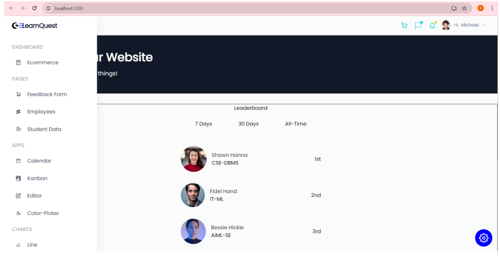
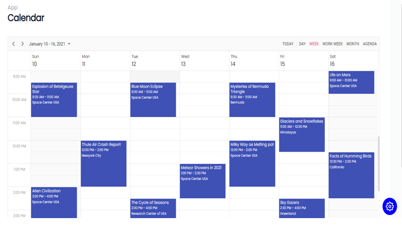
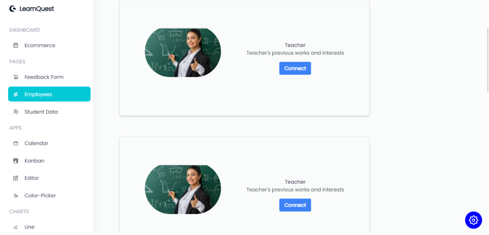
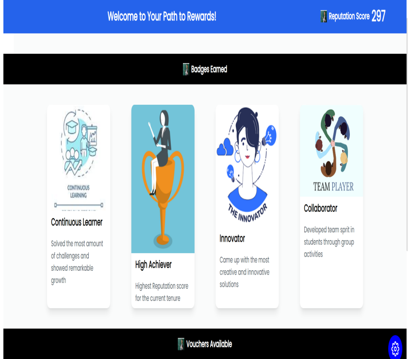

# Learn Quest

## Overview
Learn Quest is a gamified student-faculty feedback system designed to enhance the quality of education by facilitating genuine interactions between students and faculty. Leveraging gamification elements such as challenges, rewards, and leaderboards, the platform motivates students to actively participate in the feedback process.

## Features
- **Gamification**: Engaging challenges and rewards to incentivize feedback participation.
- **Reputation Score**: Faculty members receive a reputation score based on student feedback and participation in challenges.
- **Leaderboards**: Display top-ranking faculty members based on their reputation scores.
- **Letters of Recommendation**: Students can request letters of recommendation from faculty members through a user-friendly chat application.
- **Responsive Design**: Built using Tailwind CSS and Syncfusion UI for a visually appealing and mobile-friendly interface.

## Tech Stack
- **Frontend**: React.js
- **Backend**: Node.js
- **Database**: MongoDB
- **Styling**: Tailwind CSS, Syncfusion UI


## Prerequisites
- Node.js (v12 or higher)
- MongoDB

## Clone the repository

    git clone https://github.com/shreyasoumya/LearnQuest.git
    cd learn-quest

### Installation
Install dependencies

    # For the frontend
    cd client
    npm install

    # For the backend
    cd ../server
    npm install
### Configuration

- Create a .env file in the server directory and configure your MongoDB URI:

    MONGODB_URI=<your_mongodb_uri>
### Running the Application
- Start the backend server:
    ```bash
    cd server
    npm start
- Start the frontend application:
    ```bash
    cd client
    npm start
- Open your browser and go to http://localhost:3000 to access the application.

### Usage
- Students can create an account, participate in challenges, and provide feedback on faculty.
- Faculty members can view feedback, participate in challenges, and track their reputation scores.

## Screenshots

Here are some screenshots of the Learn Quest application:

### Home Page


### Calender Page


### Message your Teacher


### Rewards


### Contributing

Contributions are welcome! If you have suggestions for improvements or features, please fork the repository and submit a pull request. Here are some ways you can contribute:
- Report bugs or issues.
- Suggest new features or enhancements.
- Improve documentation.

### License

This project is licensed under the MIT License. See the [LICENSE](LICENSE) file for details.

### Contact

For any questions or feedback, feel free to reach out:

- **Shreya Murthy**
- **Email**: shreyamurthy99@gmail.com
- **GitHub**: [shreyasoumya](https://github.com/shreyasoumya)


